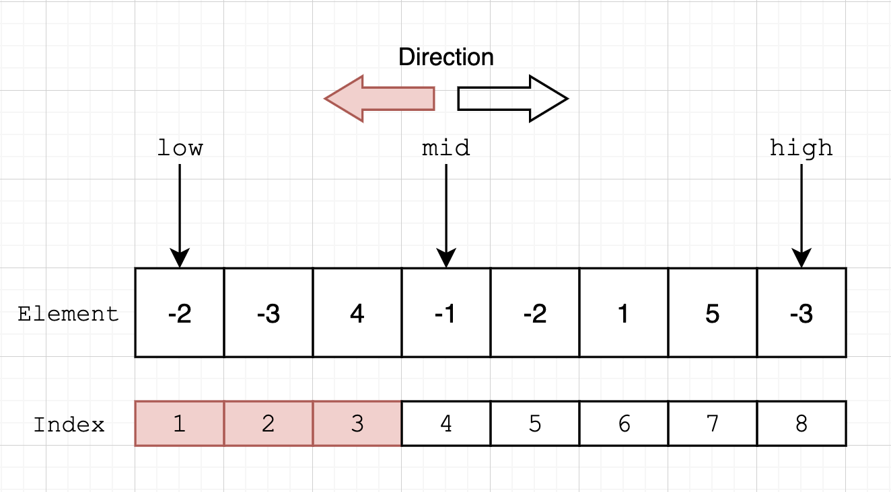
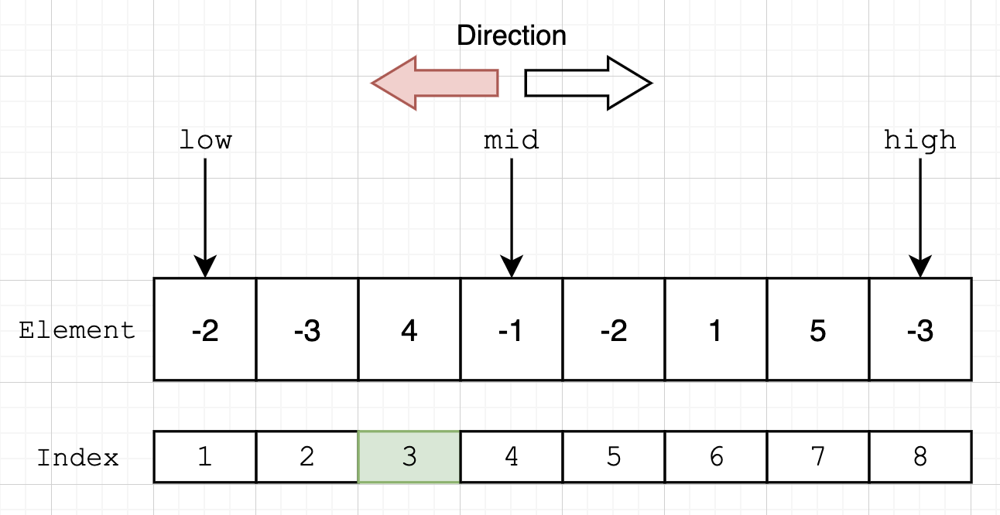
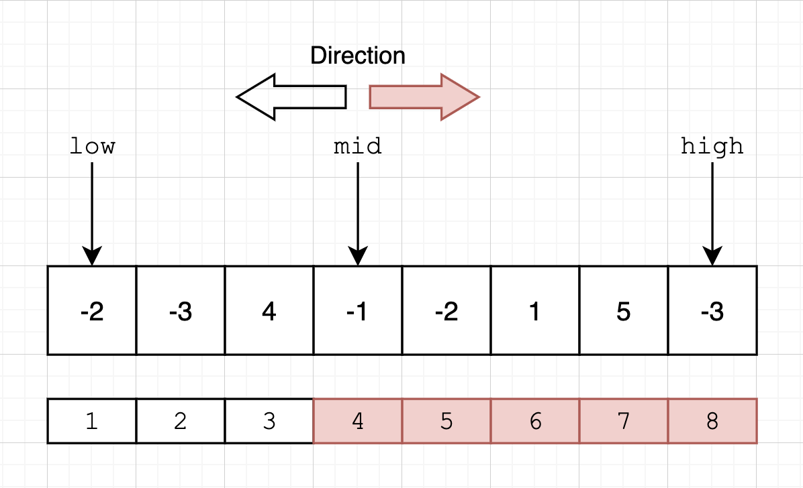
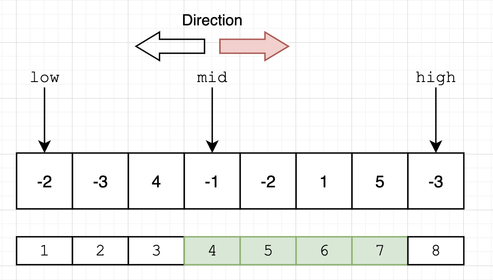

# Max Sub-array (122A)

## Problem Statement

> **Question.** Given a 1-dimensional array, find a **contiguous** sub-array with the largest sum

`A[1...N]: List<number>`
:   the array we select from

## Dividing the problem

The maximum sub-array can show up in 3 places:

1. The left half of $A$
2. The right half of $A$
3. The middle section of $A$

The left half and right half does not overlap. Overlap is handled by the middle section.

## Base Cases

There are 2 base cases:

1. $A$ is empty, so we return 0 for the sum of nothing.
2. $A$ has exactly 1 element, so we return that element $A[1]$

## Recursive Cases

To avoid passing the main array around on the stack, we can use the **2 pointer** approach with `low` and `high` pointers. The recursive calls will look like:

```c
function MaxSubarray():
    mid = floor((low + high) / 2)
    leftSum = MaxSubarray(low, mid)
    rightSum = MaxSubarray(mid + 1, high)
    middleSum = MaxMiddleSum(low, mid, high)
```

where the 2 recursive calls correspond to the left and right half of $A$.

### The Max Middle Sum

The name is kinda misleading, but we want to consider this:

> **Question.** What contiguous sub-array, that might contain the middle element, gives us the maximum sum?

So we check both ways. **Take the element if it keeps the array contiguous AND increases the sum.**

1. Check from `mid - 1` to `low`
    
    ```c
    // Inside MaxMiddleSum
    
    // Increases only when currLeftSum is better
    bestLeftSum = -Infinity
    // Always increases bc the sub-array need to be contiguous
    currLeftSum = 0  
    
    // for loop must go this direction
    // because the max middle sum could contain both left and right
    for i = mid - 1 to low:
    	currLeftSum += A[i]
    	if currLeftSum > bestLeftSum:
    		bestLeftSum = currLeftSum
    ```
    
    **Example.** Left Half
    
    ||| Selecting...
    

    ||| Done selecting, `sum = 4`
    
    
    
    |||

    
2. Then check from `mid` to `high`
    
    ```c
    // Inside MaxMiddleSum
    bestRightSum = -Infinity
    currRightSum = 0
    
    for i = mid to high:
    	currRightSum += A[i]
    	if currRightSum > bestRightSum:
    		bestRightSum = currRightSum
    ```
    
    **Example.** Right Half
    
    ||| Selecting...
    

    ||| Done selecting, `sum = 3`
    
    
    
    |||
    
    
3. The best middle sum could also involve both the left and right half, for example if all elements are positive. So we take the `max(...)` of all:
    
    ```c
    // Inside MaxMiddleSum
    return max(bestLeftSum + bestRightSum, 
               bestLeftSum,
               bestRightSum)
    ```
    

## Combining the Results

Now we know what’s max in left, right, and middle, we just take the max.

```c
// Inside MaxSubarray
return max(leftSum, rightRum, middleSum)
```

## Pseudocode

```c
function MaxMiddleSum(A[low...high], mid) -> number:
	bestLeftSum = -Infinity
	currLeftSum = 0
	
	for i = mid - 1 to low:
		currLeftSum += A[i]
		if currLeftSum > bestLeftSum:
			bestLeftSum = currSum
	
	bestRightSum = -Infinity
	currRightSum = 0
	
	for i = mid to high:
		currRightSum += A[i]
		if currRightSum > bestRightSum:
			bestRightSum = currRightSum

	return max(
		bestLeftSum + bestRightSum, 
        bestLeftSum,
        bestRightSum
	)

function MaxSubarray(A[low...high]) -> number:
	if A is empty:
		return 0 

	if low == high:
		return A[1]

	mid = floor((low + high) / 2)
	leftSum = MaxSubarray(A[low...mid])
	rightSum = MaxSubarray(A[mid + 1...high])
	middleSum = MaxMiddleSum(A[low...high], mid)

	return max(leftSum, rightSum, middleSum)
```

## Python: Max Subarray

[!badge variant="dark" size='l' icon="mark-github" target="blank" text="Github"](https://github.com/tomli380576/ECS122A-Algorithms-python-implementation/blob/main/Implementations/max-sub-array.py)

---

Go faster: Max Subarray: Kadane’s Algorithm (WIP)
