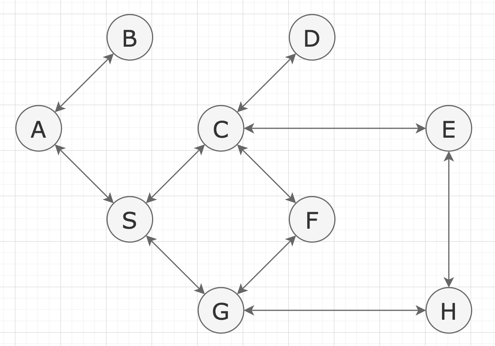
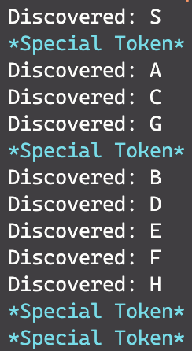
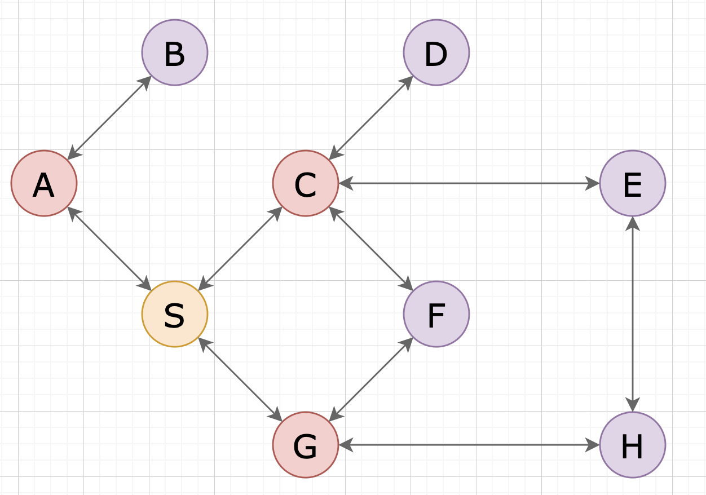
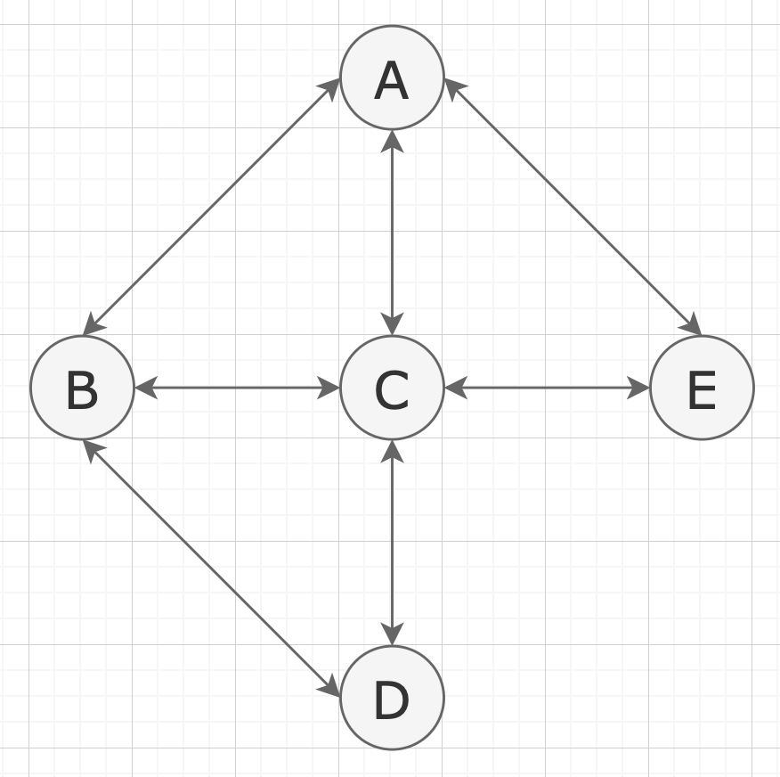
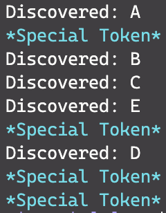
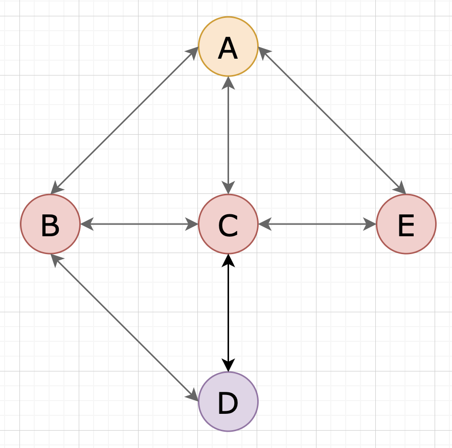

# Breadth First Search (122A)

## Basics

We can implement BFS from whatever first search by using a **Queue**.

|||  Barebones 122A Version

```c
function BFS_Search(G, start):
	for each vertex v in G:
		mark v as NEW

	queue = Queue()
	queue.put(start)
	mark start as VISITED

	while queue is not empty:
		u = queue.popFirst()
		process(u)
		for each adjacent vertex v:
			if v is NEW:
				mark v as VISITED
				queue.put(v)
```

||| Queue based WhateverFirstSearch

```c
function WFS_Breadth(G, start):
	for each vertex v in G:
		mark v as NEW

	queue = Queue()
	queue.put(start)

	while queue is not empty:
		u = queue.popFirst()

		if u is NEW:
			process(u)
			mark u as VISITED
			for each adjacent vertex v:
				queue.put(v)
```
|||

The 122A version checks whether the adjacent vertex `v` is visited. The WFS version checks if the current vertex `u` is new. 

### :icon-code: Python 

[!badge variant="dark" size='l' icon="mark-github" target="blank" text="Github"](https://github.com/tomli380576/ECS122A-Algorithms-python-implementation/blob/5a7df2b8860fca70fa0f15713fa7d25610accb74/Implementations/basic-BFS.py#L21-L37)

###  With time (full 122A Version)

We can also record "when" a vertex is visited. Each time we see a new vertex, we increment the "time". The discover time of a vertex starts with $\infin$.

```c #2
function BFS_Search(G, start):
	DISCOVER_TIME = {}
	queue = Queue()

	for each vertex v in G:
		DISCOVER_TIME[v] = Infinity
	
	DISCOVER_TIME[start] = 0
	queue.put(start)

	while queue is not empty:
		u = queue.popFirst()
		for each adjacent vertex v:
			if DISCOVER_TIME[v] == Infinity:
				process(v) // arbitrary subroutine
				DISCOVER_TIME[v] = DISCOVER_TIME[u] + 1
				queue.put(v)
```

##  Observing BFS’s Behavior

We can observe how each ‘layer’ of the graph is being visited by BFS by adding a special token.
- The changes are highlighted. Everything else is the same. 

+++ Barebones Version

```c #8,12-15
function BFS_WithToken(G, start):
	queue = Queue()

	for each vertex v in G:
		mark v as NEW

	queue.put(v)
	queue.put(TOKEN)

	while queue has at least 1 vertex:
		u = queue.popFirst()
		if u == TOKEN:
			print(TOKEN)
			queue.put(u)
		else:
			if u is NEW:
				process(u)
				mark u as VISITED
				for each adjacent vertex v:
					queue.put(v)
```

!!!danger
`while queue has at least 1 vertex` does not mean `queue.size > 0`. The special token is not a vertex.
!!!

+++ With Clock (122A Version)
    
```c #10,14-16
function BFS_WithToken(G, start):
	DISCOVER_TIME = {}
	queue = new Queue()

	for each vertex v in G:
		DISCOVER_TIME[v] = Infinity
	
	DISCOVER_TIME[start] = 0
	queue.put(v)
	queue.put(TOKEN)

	while queue has at least 1 vertex:
		u = queue.popFirst()
		if u = TOKEN:
			print(TOKEN)
			queue.put(u)
		else:
			for all edges u→v:
				if DISCOVER_TIME[v] == Infinity:
					process(v)
					DISCOVER_TIME[v] = DISCOVER_TIME[u] + 1
					queue.put(v)
```

!!!danger
`while queue has at least 1 vertex` does not mean `queue.size > 0`. The special token is not a vertex.
!!!

+++

### :icon-code: Python

[!badge variant="dark" size='l' icon="mark-github" target="blank" text="Github"](https://github.com/tomli380576/ECS122A-Algorithms-python-implementation/blob/5a7df2b8860fca70fa0f15713fa7d25610accb74/Implementations/basic-BFS.py#L59-L85)

##  Examples

###  EX.1

{.image-m}

Given this graph, and we start at vertex $\tt{S}$

|||Text

|||Graph


Starting from $\tt  S$, we can see that all the red nodes $\tt{\red{ACG}}$ are 1 edge away, and the purple nodes $\tt\purple{BDEFH}$ are 2 edges away.
|||

###  EX.2

{class="image-m"}

If we start at $\tt{\color{darkorange}A}$, then the graph will be visited in this order: $\tt{{\color{darkorange} A}\to \red {BCE}\to\purple D}$

Vertices with the same color could be visited in any order depending on the order of insertion, but the overall order is Orange → Red → Purple.

Running the code from 2.3:

|||Text

|||Graph

|||

