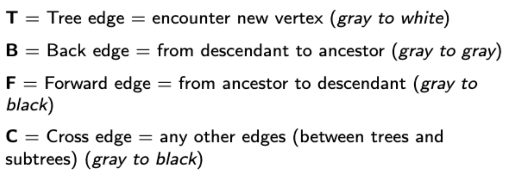

# Recursive Depth First Search (122A)

## Vertex Status

Similar to whatever first search, we assign each vertex a $\purple{\texttt{STATUS}}$.

- $\texttt{NEW}$: literally never seen before, all vertices start with this status
- $\texttt{ACTIVE}$: seen before, but the adjacent vertices are not done processing yet
- $\texttt{FINISHED}$: the vertex is seen and all its children are done processing

## Pseudocode

+++ Barebones Version

```c
// main routine
function DFS_Search(G):
	for each vertex v in G:
		mark v as NEW
	for each vertex v in G:
		if v is NEW:
			DFS_Visit(v)

function DFS_Visit(u):
	mark u as ACTIVE
	// process when u is ACTIVE
	Preprocess(u) 
	
	for each adjacent vertex v:
		if v is NEW: 
			DFS_Visit(v) 

	mark u as FINISHED
	// process when u is FINISHED
	Postprocess(u)

```

+++ With Clock (122A)

```c
// globals
time = 0 
DISCOVER_TIME = {}
FINISH_TIME = {}

// main routine
function DFS_Search(G):
	for each vertex v in G:
		mark v as NEW
	for each vertex v in G:
		if v is NEW:
			DFS_Visit(v)

function DFS_Visit(u):
	mark u as ACTIVE
	time++
	DISCOVER_TIME[u] = time
	Preprocess(u)
	
	for each adjacent vertex v:
		if v is NEW: 
			DFS_Visit(v) 

	mark u as FINISHED
	time++
	FINISH_TIME[u] = time
	Postprocess(u)
```

+++


### :icon-code: Python: Basic DFS

[!badge variant="dark" size='l' icon="mark-github" target="blank" text="Github"](https://github.com/tomli380576/ECS122A-Algorithms-python-implementation/blob/main/Implementations/basic-DFS.py)


### Comparison with stack based Whatever First Search


|||WFS with Stack
```c
function WFS_Depth(G):
	for each vertex v in G:
		mark v as NEW
	for each vertex v in G:
		if v is NEW:
			WFS_Visit(G, v)
			
function WFS_Visit(G, start):
	stack = Stack()
	stack.put(start)

	while stack is not empty:
		u = stack.popFirst()
		if u is not VISITED:
			process u
			mark u as VISITED
			for each adjacent vertex v:
				stack.put(v)
```
|||Recursive
```c
function DFS_Search(G):
	for each vertex v in G:
		mark v as NEW
	for each vertex v in G:
		if v is NEW:
			DFS_Visit(v)

function DFS_Visit(u):
	mark u as ACTIVE
	Preprocess(u)
	
	for each adjacent vertex v:
		if v is NEW: 
			DFS_Visit(v) 

	mark u as FINISHED
	Postprocess(u)

```
|||


The recursive version replaces `stack.put(v)` with the recursive call `DFS_Visit(v)`.

`while stack is not empty` is the same as coming back to the initial call (empty call stack).

Every time `DFS_Visit(v)` is called in the main routine, a new call stack is initialized. WFS does this by calling the stack constructor.


## Runtime Analysis

For a graph with $V$ vertices and $E$ edges, we call the `DFS_Visit(v)` function $V$ times in the main routine. The total number of recursive calls inside `DFS_Visit(v)` is $E$ times because we will traverse each edge exactly once, so $E$ times for the entire graph.

Therefore the total runtime is $O(V+E)$.


## Classifying Edges and Cycle Detection

There are 4 possible types of edges:

$$
\begin{array}{||c:cccc||}
\hline\\
\text{Tree} & &\texttt{ACTIVE}&\longrightarrow& \texttt{NEW}\\\\
\text{Back}&& \texttt{ACTIVE}&\longrightarrow& \texttt{ACTIVE}\\\\
\text{Forward}&&\texttt{ACTIVE}&\longrightarrow& \texttt{FINISHED}\\\\
\text{Cross} &&& \text{Everything else}\\\\
\hline

\end{array}
$$

More specifically:



### Edge Interpretations

- At least one back edge is found $\iff$ the graph has a cycle. So Directed Acyclic Graphs (Like a DP dependency graph) cannot have a back edge. 
    
- Found at least 1 cross or forward edge $\implies$ the graph is directed

- Read more [here](https://courses.csail.mit.edu/6.006/spring11/rec/rec13.pdf)

### :icon-code: Python: DFS with edge classification

[!badge variant="dark" size='l' icon="mark-github" target="blank" text="Github"](https://github.com/tomli380576/ECS122A-Algorithms-python-implementation/blob/main/Implementations/DFS-cycle-detection.py)

Right now it only finds back and tree edges correctly, still figuring out how to find forward and cross edges
