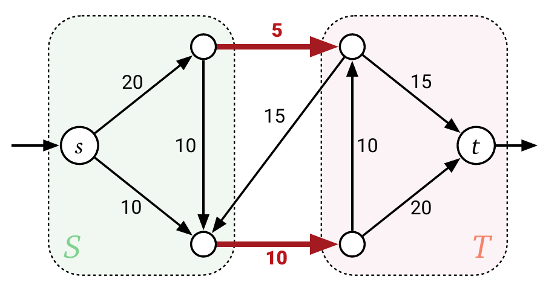

# Max-Flow Min Cut Theorem

## When did Ford-Fulkerson Stop

Recall that FF stops when there's no path from $s$ to $t$ in the current residual graph $G^f$. 

## Cut, st-Cut

A cut of a graph is a partition of $V = L\cup R$ such that $L$ and $R$ are disjoint. An st-cut is a cut where $s\in L, t\in R$.

Let the **capacity** of this partition $\text{cap}(L, R)$, these edges are counted towards capacity:

$$
\text{cap}(L, R) = \sum_{\substack{vw\in E\\v\in L, w\in R}}c_{vw}
$$

**Notice that no backward edges are included.**

## Min Cut Problem

Input is the flow network, output is an st-cut $(L, R)$ that minimizes $\text{cap}(L, R)$